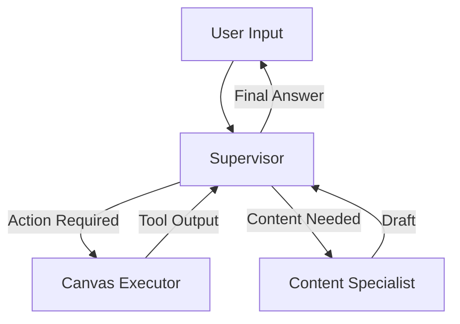

# CLAI: The Autonomous AI Teaching Assistant

> **An autonomous multi-agent system that manages your Canvas LMS, creates assignments, and drafts curriculum in real-time—saving educators hours every week.**

 <!-- Add a screenshot or banner here -->

---

## 💡 The Problem
Educators are drowning in administrative work. Managing an LMS like Canvas requires endless clicking to update due dates, create assignments, and post announcements. Teaching Assistants (TAs) are scarce, and existing "chatbots" can only answer questions—they can't **do** the work.

## 🚀 The Solution
**Canvas Agent** is not just a chatbot. It is an **Agentic System** capable of executing complex workflows. It connects directly to your Canvas API to perform actions, reason about pedagogy, and act as a 24/7 super-admin.

### Key Features
*   **Real-Time Execution**: Instantly creates courses, assignments, and announcements in your live Canvas instance.
*   **Intelligent Routing**: Uses a **Gateway Pattern** to route simple tasks (e.g., "List courses") to fast/cheap models (`gpt-4o-mini`) and complex reasoning (e.g., "Draft a rubric") to smart models (`gpt-4o`).
*   **Pedagogical Reasoning**: Can draft detailed grading rubrics, syllabus summaries, and student feedback using advanced prompt engineering.
*   **Business Observability**: Tracks "Business Events" (e.g., `assignment_created`) rather than just technical logs, giving you a dashboard of productivity.

---

## 🛠️ Architecture & Tech Stack

This project was built using a modern AI stack designed for reliability and scale.

| Component | Technology | Role |
| :--- | :--- | :--- |
| **Orchestration** | **LangGraph** | Manages the multi-agent state machine (Supervisor, Executor, Specialist). |
| **Gateway & Obs** | **Keywords AI** | Handles model routing, semantic caching, and business metrics logging. |
| **Development** | **Trae IDE** | Used for rapid code generation and refactoring. |
| **Backend** | **FastAPI** | Python server handling API requests and authentication. |
| **Frontend** | **React** | Clean, responsive chat interface for users. |
| **Integration** | **Canvas LMS API** | The core external system being managed. |

### The Agent Workflow
1.  **Supervisor Node**: The "Brain". Receives user input and decides whether to route it to the Executor (for actions), the Specialist (for content), or finish.
2.  **Canvas Executor**: The "Hands". Equipped with 15+ tools to interact with the Canvas API (GET courses, POST assignments, etc.).
3.  **Content Specialist**: The "Pedagogue". A pure LLM node optimized for generating high-quality educational content (rubrics, feedback).



---

## ⚡ Getting Started

### Prerequisites
*   Python 3.10+
*   Node.js 16+
*   A **Canvas LMS** Account (Free "Free-for-Teacher" accounts work!)
*   **Keywords AI** API Key (for the Gateway/LLM)
*   **OpenAI** API Key (if bypassing gateway, but Keywords is recommended)

### 1. Clone the Repository
```bash
git clone https://github.com/yourusername/canvas-lms-agent.git
cd canvas-lms-agent
```

### 2. Backend Setup
Create a `.env` file in the root directory:
```env
# AI Configuration
KEYWORDSAI_API_KEY=your_keywords_ai_key
KEYWORDSAI_BASE_URL=https://api.keywordsai.co/api/

# Canvas Configuration
CANVAS_API_URL=https://canvas.instructure.com # Or your school's domain
CANVAS_API_TOKEN=your_canvas_token # Generate this in Canvas Settings -> Access Tokens

# App Config
DEMO_MODE=false # Set to true to simulate actions (safe for testing)
```

Install dependencies and run the server:
```bash
# Install Python dependencies
pip install -r requirements.txt

# Run the backend
python src/server.py
```
*The backend will start on `http://localhost:8001`.*

### 3. Frontend Setup
```bash
cd frontend
npm install
npm start
```
*The frontend will open at `http://localhost:3000`.*

---

## 🎮 Usage Examples

Once the system is running, try these commands in the chat interface:

**1. Administration (Real Execution)**
> "Create an assignment called 'AI Ethics Essay' in my Sandbox course due next Friday at 5pm."
*   *Result:* The agent will verify the course exists, calculate the date, and create the assignment in Canvas, returning a direct link.

**2. Content Creation (Reasoning)**
> "Draft a grading rubric for this essay focusing on critical thinking and technical accuracy."
*   *Result:* The Content Specialist will generate a structured Markdown table with criteria and point values.

**3. Information Retrieval**
> "List all my courses and show me the assignments due this week."
*   *Result:* The agent executes multiple API calls (Get Courses -> Get Assignments) and synthesizes the data.

---

## 📊 Observability (Keywords AI)

We use **Keywords AI** to monitor the health and value of the agent.

*   **Gateway Routing**: Automatically switches between `gpt-4o-mini` and `gpt-4o` based on prompt complexity (Cost Savings).
*   **Semantic Caching**: If a user asks the same question twice (e.g., "List courses"), the second response is instant (0ms latency).
*   **Custom Events**: Go to the Keywords AI Dashboard to see a timeline of `assignment_created` events, proving the agent's ROI.

---

## 🤝 Contributing

Contributions are welcome! Please feel free to submit a Pull Request.

## 📄 License

This project is licensed under the MIT License - see the [LICENSE](LICENSE) file for details.
