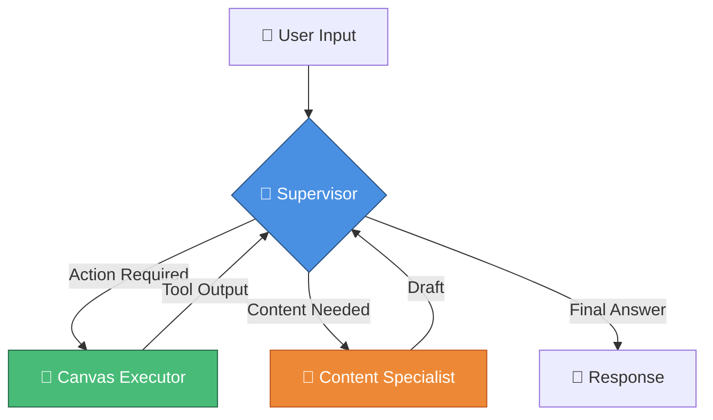

<p align="center">
  
  
  
  
  
  
</p>

<h1 align="center">🎓 CLAI</h1>
<h3 align="center">The Autonomous AI Teaching Assistant</h3>

<p align="center">
  <strong>An autonomous multi-agent system that manages your Canvas LMS, creates assignments, and drafts curriculum in real-time—saving educators hours every week.</strong>
</p>

<p align="center">
  <a href="#-quick-start">Quick Start</a> •
  <a href="#-docker-setup-recommended">Docker</a> •
  <a href="#-features">Features</a> •
  <a href="#-architecture">Architecture</a> •
  <a href="#-canvas-mcp-integration">Canvas MCP</a> •
  <a href="#-usage">Usage</a> •
  <a href="#-contributing">Contributing</a>
</p>

---

## 🎯 The Problem

Educators are drowning in administrative work:

| Challenge | Impact |
|-----------|--------|
| **Endless LMS clicking** | Hours lost updating due dates, creating assignments, posting announcements |
| **TA shortage** | Not enough human assistants to handle the workload |
| **Limited AI tools** | Existing chatbots can only answer questions—they can't **execute** tasks |

## 💡 The Solution

**CLAI** isn't just a chatbot. It's an **Agentic System** that connects directly to your Canvas API to:

- ✅ **Execute actions** — Create courses, assignments, and announcements instantly
- ✅ **Reason about pedagogy** — Draft rubrics, feedback, and syllabus content
- ✅ **Act autonomously** — Serve as your 24/7 super-admin

---

## ✨ Features

### 🚀 Real-Time Execution
Instantly creates and modifies content in your live Canvas instance—no manual clicking required.

### 🧠 Intelligent Model Routing
Uses a **Gateway Pattern** to optimize cost and performance:
- **Simple tasks** (e.g., "List courses") → Fast/cheap models (`gpt-4o-mini`)
- **Complex reasoning** (e.g., "Draft a rubric") → Smart models (`gpt-4o`)

### 📚 Pedagogical Intelligence
Generates high-quality educational content using advanced prompt engineering:
- Detailed grading rubrics
- Comprehensive syllabus summaries
- Personalized student feedback

### 📊 Business Observability
Tracks meaningful "Business Events" (e.g., `assignment_created`) rather than just technical logs—giving you a clear dashboard of productivity gains.

---

## 🏗️ Architecture

### Tech Stack

| Component | Technology | Purpose |
|:----------|:-----------|:--------|
| **Orchestration** | [LangGraph](https://github.com/langchain-ai/langgraph) | Multi-agent state machine management |
| **LMS Integration** | [Canvas MCP](https://github.com/anthropics/canvas-mcp) | Model Context Protocol server for Canvas |
| **Gateway & Observability** | [Keywords AI](https://keywordsai.co) | Model routing, semantic caching, metrics |
| **Development** | [Trae IDE](https://trae.ai) | Rapid code generation and refactoring |
| **Backend** | [FastAPI](https://fastapi.tiangolo.com) | High-performance Python API server |
| **Frontend** | [React](https://react.dev) | Responsive chat interface |
| **Containerization** | [Docker](https://docker.com) | Reproducible deployment environment |
| **Integration** | [Canvas LMS API](https://canvas.instructure.com/doc/api/) | Core external system |

### Agent Architecture

The system uses a **Supervisor-Executor-Specialist** pattern:

```
┌─────────────────────────────────────────────────────────────┐
│                        USER INPUT                           │
└─────────────────────────┬───────────────────────────────────┘
                          │
                          ▼
┌─────────────────────────────────────────────────────────────┐
│                    🧠 SUPERVISOR                            │
│                     "The Brain"                             │
│         Analyzes intent, routes to appropriate agent        │
└───────────┬─────────────────────────────────┬───────────────┘
            │                                 │
            ▼                                 ▼
┌───────────────────────────┐   ┌───────────────────────────┐
│    🤖 CANVAS EXECUTOR     │   │   📝 CONTENT SPECIALIST   │
│       "The Hands"         │   │      "The Pedagogue"      │
│                           │   │                           │
│  • 15+ Canvas API tools   │   │  • Rubric generation      │
│  • GET/POST/PUT/DELETE    │   │  • Feedback drafting      │
│  • Real-time execution    │   │  • Syllabus creation      │
└───────────┬───────────────┘   └───────────┬───────────────┘
            │                                 │
            └─────────────┬───────────────────┘
                          │
                          ▼
┌─────────────────────────────────────────────────────────────┐
│                     FINAL RESPONSE                          │
└─────────────────────────────────────────────────────────────┘
```



---

## 🚀 Quick Start

### Prerequisites

| Requirement | Version | Notes |
|-------------|---------|-------|
| Python | 3.10+ | Backend runtime |
| Node.js | 16+ | Frontend build |
| Canvas LMS | — | [Free teacher accounts](https://canvas.instructure.com/register) available |
| Keywords AI | — | [Get API key](https://keywordsai.co) |

### 1️⃣ Clone the Repository

```bash
git clone https://github.com/yourusername/clai.git
cd clai
```

### 🐳 Docker Setup (Recommended)

The fastest way to get CLAI running:

```bash
# Build and start all services
docker-compose up --build

# Or run in detached mode
docker-compose up -d --build
```

**Docker Compose Services:**

| Service | Port | Description |
|---------|------|-------------|
| `backend` | 8001 | FastAPI server with LangGraph agents |
| `frontend` | 3000 | React chat interface |
| `redis` | 6379 | Semantic caching layer |

```yaml
# docker-compose.yml preview
version: '3.8'
services:
  backend:
    build: .
    ports:
      - "8001:8001"
    env_file:
      - .env
    depends_on:
      - redis
      
  frontend:
    build: ./frontend
    ports:
      - "3000:3000"
    depends_on:
      - backend
      
  redis:
    image: redis:alpine
    ports:
      - "6379:6379"
```

> 💡 **Tip:** Use `docker-compose logs -f backend` to monitor agent activity in real-time

---

### Manual Setup (Alternative)

#### 2️⃣ Configure Environment

Create a `.env` file in the root directory:

```env
# ═══════════════════════════════════════════
# AI Configuration
# ═══════════════════════════════════════════
KEYWORDSAI_API_KEY=your_keywords_ai_key
KEYWORDSAI_BASE_URL=https://api.keywordsai.co/api/

# ═══════════════════════════════════════════
# Canvas Configuration
# ═══════════════════════════════════════════
CANVAS_API_URL=https://canvas.instructure.com  # Or your institution's domain
CANVAS_API_TOKEN=your_canvas_token             # Settings → Access Tokens

# ═══════════════════════════════════════════
# Application Settings
# ═══════════════════════════════════════════
DEMO_MODE=false  # Set to 'true' for safe testing (simulates actions)
```

> 💡 **Tip:** Generate your Canvas API token at `Canvas → Account → Settings → New Access Token`

#### 3️⃣ Start the Backend

```bash
# Install dependencies
pip install -r requirements.txt

# Launch the server
python src/server.py
```

The backend will be available at `http://localhost:8001`

#### 4️⃣ Start the Frontend

```bash
cd frontend
npm install
npm start
```

The application will open at `http://localhost:3000`

---

## 🎮 Usage

### Administration Tasks

> **You:** "Create an assignment called 'AI Ethics Essay' in my Sandbox course due next Friday at 5pm."

**CLAI will:**
1. Verify the course exists
2. Calculate the correct due date
3. Create the assignment in Canvas
4. Return a direct link to the new assignment

### Content Creation

> **You:** "Draft a grading rubric for this essay focusing on critical thinking and technical accuracy."

**CLAI will generate:**

| Criterion | Excellent (4) | Good (3) | Developing (2) | Beginning (1) |
|-----------|---------------|----------|----------------|---------------|
| Critical Thinking | Exceptional analysis with original insights | Strong analysis with clear reasoning | Basic analysis present | Limited or no analysis |
| Technical Accuracy | All facts correct, sources cited | Minor errors, mostly accurate | Several errors present | Significant inaccuracies |
| ... | ... | ... | ... | ... |

### Information Retrieval

> **You:** "List all my courses and show me the assignments due this week."

**CLAI will:**
1. Execute `GET /courses` API call
2. Execute `GET /assignments` for each relevant course
3. Filter and synthesize the data
4. Present a clear, organized summary

---

## 📊 Observability

CLAI integrates with **Keywords AI** for comprehensive monitoring:

### 🔀 Intelligent Routing
Automatically switches between models based on prompt complexity—reducing costs without sacrificing quality.

### ⚡ Semantic Caching
Repeated queries (e.g., "List courses") return instantly with 0ms latency from cache.

### 📈 Business Metrics
Track meaningful events in your Keywords AI Dashboard:

| Event | Description |
|-------|-------------|
| `assignment_created` | New assignment added to Canvas |
| `announcement_posted` | Course announcement published |
| `rubric_generated` | AI-drafted rubric created |
| `course_modified` | Course settings updated |

---

## 🔌 Canvas MCP Integration

CLAI leverages the **Canvas MCP (Model Context Protocol)** server to provide seamless integration with Canvas LMS through a standardized interface.

### What is Canvas MCP?

[Canvas MCP](https://github.com/anthropics/canvas-mcp) is an open-source Model Context Protocol server that exposes Canvas LMS functionality as tools that AI agents can use. It provides:

- **Standardized Tool Interface** — Consistent API for all Canvas operations
- **Authentication Handling** — Secure token management for Canvas API
- **Error Recovery** — Graceful handling of API rate limits and failures
- **Type Safety** — Strongly typed requests and responses

### Available MCP Tools

| Tool | Description |
|------|-------------|
| `canvas_list_courses` | Retrieve all courses for the authenticated user |
| `canvas_get_course` | Get detailed information about a specific course |
| `canvas_create_assignment` | Create a new assignment with full configuration |
| `canvas_update_assignment` | Modify existing assignment properties |
| `canvas_list_assignments` | List all assignments in a course |
| `canvas_create_announcement` | Post announcements to course participants |
| `canvas_list_students` | Get enrolled students for a course |
| `canvas_get_submissions` | Retrieve assignment submissions |
| `canvas_grade_submission` | Submit grades and feedback |
| `canvas_create_module` | Create course modules |
| `canvas_list_modules` | List all modules in a course |
| `canvas_create_page` | Create wiki pages in a course |
| `canvas_list_pages` | List all pages in a course |
| `canvas_get_calendar_events` | Retrieve calendar events |
| `canvas_create_calendar_event` | Add events to course calendar |

### MCP Configuration

Add the Canvas MCP server to your MCP settings:

```json
{
  "mcpServers": {
    "canvas": {
      "command": "npx",
      "args": ["-y", "canvas-mcp"],
      "env": {
        "CANVAS_API_TOKEN": "your_canvas_token",
        "CANVAS_BASE_URL": "https://canvas.instructure.com"
      }
    }
  }
}
```

### Using with Claude Desktop

CLAI's Canvas MCP integration works seamlessly with Claude Desktop:

1. Install the Canvas MCP server globally:
   ```bash
   npm install -g canvas-mcp
   ```

2. Add to your Claude Desktop configuration (`~/Library/Application Support/Claude/claude_desktop_config.json` on macOS):
   ```json
   {
     "mcpServers": {
       "canvas": {
         "command": "canvas-mcp",
         "env": {
           "CANVAS_API_TOKEN": "your_token_here",
           "CANVAS_BASE_URL": "https://your-institution.instructure.com"
         }
       }
     }
   }
   ```

3. Restart Claude Desktop to load the Canvas tools

---

## 📁 Project Structure

```
clai/
├── 📂 src/
│   ├── 📄 server.py          # FastAPI application entry point
│   ├── 📂 agents/
│   │   ├── 📄 supervisor.py  # Main routing logic
│   │   ├── 📄 executor.py    # Canvas API tools
│   │   └── 📄 specialist.py  # Content generation
│   ├── 📂 tools/
│   │   ├── 📄 canvas.py      # Canvas API wrappers
│   │   └── 📄 mcp_client.py  # Canvas MCP integration
│   └── 📂 utils/
│       └── 📄 config.py      # Environment configuration
├── 📂 frontend/
│   ├── 📂 src/
│   │   ├── 📄 App.jsx        # Main React component
│   │   └── 📂 components/    # UI components
│   ├── 📄 Dockerfile         # Frontend container config
│   └── 📄 package.json
├── 📄 Dockerfile             # Backend container config
├── 📄 docker-compose.yml     # Multi-service orchestration
├── 📄 requirements.txt       # Python dependencies
├── 📄 .env.example           # Environment template
└── 📄 README.md
```

---

## 🛣️ Roadmap

- [ ] **Multi-LMS Support** — Extend to Blackboard, Moodle, Brightspace via additional MCP servers
- [ ] **Student-Facing Mode** — Safe, read-only assistant for students
- [ ] **Bulk Operations** — Mass grade uploads, batch assignment creation
- [ ] **Analytics Dashboard** — Visualize teaching assistant productivity
- [ ] **Voice Interface** — Hands-free course management
- [ ] **MCP Ecosystem** — Integration with additional MCP servers (Google Drive, Slack, Calendar)

---

## 🤝 Contributing

We welcome contributions! Here's how to get started:

1. **Fork** the repository
2. **Create** a feature branch (`git checkout -b feature/amazing-feature`)
3. **Commit** your changes (`git commit -m 'Add amazing feature'`)
4. **Push** to the branch (`git push origin feature/amazing-feature`)
5. **Open** a Pull Request

Please read our [Contributing Guidelines](CONTRIBUTING.md) for details on our code of conduct and development process.

---

## 📄 License

This project is licensed under the **MIT License** — see the [LICENSE](LICENSE) file for details.

---

## 🙏 Acknowledgments

- [Canvas MCP](https://github.com/anthropics/canvas-mcp) — The Model Context Protocol server powering our Canvas LMS integration. Special thanks to the MCP team for creating a standardized way to connect AI agents with educational tools.
- [LangChain](https://langchain.com) — For the incredible LangGraph framework that powers our multi-agent orchestration
- [Keywords AI](https://keywordsai.co) — For gateway and observability infrastructure enabling intelligent model routing
- [Anthropic](https://anthropic.com) — For Claude and the Model Context Protocol specification
- [Instructure](https://www.instructure.com) — For the Canvas LMS API that makes this integration possible
- [Trae IDE](https://trae.ai) — For accelerating development with AI-powered coding assistance
- The education technology community — For inspiration, feedback, and the shared mission of empowering educators

---

<p align="center">
  <strong>Built with ❤️ for educators everywhere</strong>
</p>

<p align="center">
  <a href="https://github.com/yourusername/clai/issues">Report Bug</a> •
  <a href="https://github.com/yourusername/clai/issues">Request Feature</a> •
  <a href="https://github.com/yourusername/clai">⭐ Star this repo</a>
</p>
